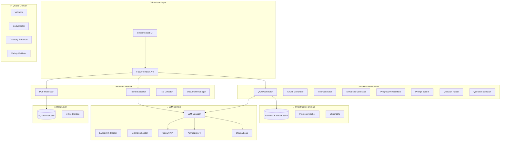

# 🎯 QCM Generator Pro - Local Edition

> **Application locale de génération automatique de QCM multilingues à partir de documents PDF**

[](https://python.org)
[](https://fastapi.tiangolo.com)
[](https://streamlit.io)
[](https://docker.com)
[](LICENSE)

## 📋 Table des Matières

- [🎯 Aperçu](#-aperçu)
- [✨ Fonctionnalités](#-fonctionnalités)
- [🏗️ Architecture](#️-architecture)
- [🚀 Installation](#-installation)
- [💻 Utilisation](#-utilisation)
- [🐳 Docker](#-docker)
- [🧪 Tests](#-tests)
- [📊 API Documentation](#-api-documentation)
- [🔧 Configuration](#-configuration)
- [🤝 Contribution](#-contribution)

## 🎯 Aperçu

QCM Generator Pro est une application complète de génération automatique de questions à choix multiples (QCM) à partir de documents PDF. Optimisée pour une utilisation locale avec support GPU (RTX 4090) et intégration d'APIs cloud.

### 🎥 Démo Rapide

```bash
# Installation rapide
git clone https://github.com/votre-username/qcm-generator-pro.git
cd qcm-generator-pro
make install-dev

# Lancement de l'interface web
make run-ui
```


## ✨ Fonctionnalités

### 🎯 **Génération Intelligente**
- ✅ **Workflow progressif** (1 → 5 → toutes les questions)
- ✅ **Validation automatique** avec points de contrôle utilisateur
- ✅ **Multi-langues** (Français, Anglais + extensible)
- ✅ **Types de questions** : Choix unique, Choix multiples
- ✅ **Niveaux de difficulté** configurables (Facile, Moyen, Difficile)

### 📚 **Gestion Documents**
- ✅ **Upload PDF** avec validation et métadonnées
- ✅ **Extraction automatique de thèmes** via LLM
- ✅ **Persistance complète** (SQLite + ChromaDB)
- ✅ **Gestion avancée** : suppression, statistiques, visualisations
- ✅ **RAG Engine** pour génération contextuelle

### 🤖 **Intégration LLM**
- ✅ **Support multi-providers** : OpenAI, Anthropic, Ollama
- ✅ **Modèles locaux** optimisés RTX 4090 (Mistral, Llama3, Phi-3)
- ✅ **Fallback automatique** et gestion d'erreurs
- ✅ **Test de connectivité** intégré

### 📤 **Export & Intégration**
- ✅ **Format Udemy CSV** (compatible plateformes e-learning)
- ✅ **Export JSON** avec métadonnées complètes
- ✅ **Aperçu des questions** avant export
- ✅ **Gestion des téléchargements**

### 🎨 **Interface Utilisateur**
- ✅ **Interface web Streamlit** moderne et responsive
- ✅ **Navigation à onglets** : Upload, Gestion, Génération, Export, Système
- ✅ **Opérations en lot** pour la gestion de documents
- ✅ **Visualisations interactives** (Plotly) des statistiques
- ✅ **Mode debug** et monitoring système

## 🏗️ Architecture

### 🎯 **NOUVELLE ARCHITECTURE** *(Janvier 2025)*

L'architecture a été **complètement réorganisée** en domaines métier pour une meilleure maintenabilité :



### 🆕 **Changements Récents** *(Janvier 2025)*

#### ✅ **Réorganisation Architecture Services**
- **21 services** réorganisés en **5 domaines métier** clairs
- **50+ imports** mis à jour dans toute la codebase
- **21/21 tests** passent toujours ✅
- **Scripts** corrigés pour les nouveaux chemins d'imports

#### 🏗️ **Nouvelle Structure Services**
```
src/services/
├── document/          📄 Gestion documents (4 services)
├── generation/        ⚡ Génération QCM (8 services)  
├── quality/          ✅ Assurance qualité (4 services)
├── llm/             🤖 Intégration LLM (3 services)
└── infrastructure/   🔧 Services infrastructure (2 services)
```

#### 🔄 **Migration des Imports**
- **Avant** : `from src.services.llm_manager import ...`
- **Après** : `from src.services.llm.llm_manager import ...`

### 📁 Structure du Projet

```
qcm-generator-pro/
├── 📄 Documents & Config
│   ├── README.md
│   ├── CLAUDE.md                 # Context pour Claude Code
│   ├── .env.example
│   └── requirements.txt
├── 🐳 Docker
│   ├── Dockerfile
│   ├── docker-compose.yml        # GPU deployment
│   └── docker-compose.cpu.yml    # CPU deployment
├── 🧪 Tests
│   ├── unit/                     # Tests unitaires
│   ├── integration/              # Tests d'intégration
│   └── fixtures/                 # Données de test
├── 📜 Scripts
│   ├── start_app.py             # Démarrage multi-processus
│   ├── docker_setup.py          # Configuration Docker
│   └── integration_test.py      # Tests d'intégration
└── 🎯 Source Code
    ├── api/                      # FastAPI endpoints
    │   ├── main.py
    │   ├── dependencies.py
    │   └── routes/
    ├── core/                     # Configuration & constantes
    │   ├── config.py
    │   ├── constants.py
    │   └── exceptions.py
    ├── models/                   # Modèles de données
    │   ├── database.py           # SQLAlchemy models
    │   ├── schemas.py            # Pydantic schemas
    │   └── enums.py              # Énumérations
    ├── services/                 # Logique métier
    │   ├── pdf_processor.py
    │   ├── theme_extractor.py
    │   ├── rag_engine.py
    │   ├── llm_manager.py
    │   ├── qcm_generator.py
    │   ├── validator.py
    │   └── document_manager.py
    ├── prompts/                  # Templates multilingues
    │   ├── templates.py
    │   └── languages/
    └── ui/                       # Interface utilisateur
        └── streamlit_app.py
```

## 🚀 Installation

### 📋 Prérequis

- **Python 3.11+**
- **Git**
- **Docker** (optionnel, pour le déploiement containerisé)
- **GPU RTX 4090** (optionnel, pour les modèles locaux)

### ⚡ Installation Rapide

```bash
# 1. Cloner le repository
git clone https://github.com/votre-username/qcm-generator-pro.git
cd qcm-generator-pro

# 2. Installation des dépendances
make install-dev

# 3. Configuration
cp .env.example .env
# Éditer .env avec vos clés API (optionnel)

# 4. Initialisation de la base de données
make db-init

# 5. Lancement de l'interface
make run-ui
```

### 🔧 Installation Manuelle

```bash
# Créer un environnement virtuel
python -m venv venv
source venv/bin/activate  # Linux/Mac
# ou
venv\Scripts\activate     # Windows

# Installer les dépendances
pip install -r requirements.txt
pip install -r requirements-dev.txt

# Installer les hooks pre-commit
pre-commit install

# Initialiser la base de données
python -c "from src.models.database import init_database; init_database()"
```

## 💻 Utilisation

### 🎯 Interface Web (Recommandé)

```bash
# Lancer l'interface Streamlit
make run-ui
# ou
streamlit run main_app.py
```

Ouvrez http://localhost:8501 dans votre navigateur.

### 🛠️ **Commandes Make Essentielles**

```bash
# 🚀 Lancement Application
make run-app          # Lance l'app complète (API + UI) - RECOMMANDÉ
make run-app-debug    # Lance en mode debug
make run-ui           # Interface Streamlit uniquement
make run              # API FastAPI uniquement

# 🧪 Tests & Validation  
make test-working     # Tests validés (21 tests) - RECOMMANDÉ
make quick-check      # Validation rapide (format + lint + tests core)
make full-check       # Validation complète

# 🔧 Développement
make install-dev      # Installation complète environnement dev
make format           # Formatage code (black + ruff)
make lint             # Linting (ruff + mypy)

# 🐳 Docker
make docker-run       # Docker avec GPU
make docker-run-cpu   # Docker CPU uniquement
make docker-clean     # Nettoyage Docker
```

### 🚀 Workflow Complet

1. **📄 Upload de Documents**
   - Sélectionnez un fichier PDF
   - Cliquez sur "🚀 Traiter le document"
   - Visualisez les thèmes extraits automatiquement

2. **📚 Gestion Documents**
   - Consultez vos documents stockés
   - Visualisez les statistiques et thèmes
   - Supprimez ou organisez vos documents

3. **🎯 Génération QCM**
   - Configurez le nombre de questions (1-50)
   - Ajustez la répartition des difficultés
   - Sélectionnez les thèmes spécifiques
   - Suivez le workflow progressif :
     - **Phase 1** : 1 question test → validation
     - **Phase 2** : 5 questions → révision
     - **Phase 3** : Questions restantes → finalisation

4. **📤 Export**
   - Choisissez le format : CSV (Udemy) ou JSON
   - Téléchargez vos questions formatées

### 🤖 API REST

```bash
# Lancer le serveur API
make run
# ou
uvicorn src.api.main:app --reload
```

Documentation API : http://localhost:8000/docs

#### Exemples d'utilisation API

```python
import requests

# Upload d'un document
files = {'file': open('document.pdf', 'rb')}
response = requests.post('http://localhost:8000/documents/upload', files=files)

# Génération de questions
config = {
    "num_questions": 10,
    "language": "fr",
    "difficulty_distribution": {"easy": 0.3, "medium": 0.5, "hard": 0.2}
}
response = requests.post('http://localhost:8000/generation/generate', json=config)
```

## 🐳 Docker

### 🚀 Déploiement GPU (RTX 4090)

```bash
# Build et lancement avec support GPU
make docker-build
make docker-run

# Ou manuellement
docker-compose up --build
```

### 💻 Déploiement CPU

```bash
# Lancement CPU uniquement
make docker-run-cpu

# Ou manuellement
docker-compose -f docker-compose.cpu.yml up --build
```

### 🔧 Configuration Docker

Le déploiement Docker inclut :
- **Service QCM Generator** (FastAPI + Streamlit)
- **Ollama** pour les modèles LLM locaux
- **Redis** pour le cache (optionnel)
- **Volumes persistants** pour données et modèles

Services disponibles :
- **Interface Web** : http://localhost:8501
- **API** : http://localhost:8000
- **Ollama** : http://localhost:11434

## 🧪 Tests

### 🏃 Exécution des Tests

#### ✅ **Tests avec Nouvelle Architecture** 
```bash
# Tests recommandés (21 tests validés)
make test-working

# Tous les tests avec couverture
make test

# Tests de base uniquement  
make test-basic

# Tests rapides (format + lint + tests core)
make quick-check

# Vérification complète (format + lint + tous les tests)
make full-check
```

#### 📊 **Couverture de Tests**
- **21/21 tests** passent avec la nouvelle architecture ✅
- Tests des modèles, schémas et fonctionnalités de base
- Validation de l'intégrité après réorganisation des services

### 📊 Couverture de Code

```bash
# Rapport de couverture
make test-cov

# Rapport HTML
coverage html
open htmlcov/index.html
```

**Objectif de couverture** : >90% pour les services core

### 🧪 Tests Manuels

```bash
# Test de l'interface complète
python scripts/integration_test.py

# Test des connexions LLM
python -c "from src.services.llm_manager import test_llm_connection_sync; print(test_llm_connection_sync())"
```

## 📊 API Documentation

### 🔗 Endpoints Principaux

#### 📄 Documents
- `POST /documents/upload` - Upload et traitement PDF
- `GET /documents/` - Liste des documents stockés
- `DELETE /documents/{id}` - Suppression de document
- `GET /documents/{id}/themes` - Thèmes d'un document

#### 🎯 Génération
- `POST /generation/generate` - Génération de questions
- `POST /generation/progressive` - Workflow progressif
- `GET /generation/sessions/{id}` - État d'une session

#### 📤 Export
- `POST /export/csv` - Export CSV (Udemy)
- `POST /export/json` - Export JSON avec métadonnées

#### ⚙️ Système
- `GET /health` - État de santé de l'application
- `GET /system/llm-status` - État des connexions LLM
- `GET /system/metrics` - Métriques système

### 📝 Schémas de Données

```python
# Configuration de génération
{
  "num_questions": 10,
  "language": "fr",
  "difficulty_distribution": {
    "easy": 0.3,
    "medium": 0.5,
    "hard": 0.2
  },
  "question_types": {
    "multiple-choice": 0.7,
    "multiple-selection": 0.3
  },
  "themes_filter": ["Thème 1", "Thème 2"]
}

# Question générée
{
  "question_text": "Qu'est-ce que Python ?",
  "question_type": "multiple-choice",
  "difficulty": "medium",
  "options": [
    {"text": "Un serpent", "is_correct": false},
    {"text": "Un langage de programmation", "is_correct": true},
    {"text": "Un fruit", "is_correct": false}
  ],
  "explanation": "Python est un langage de programmation...",
  "language": "fr"
}
```

## 🔧 Configuration

### 🌍 Variables d'Environnement

```bash
# Application
APP_NAME="QCM Generator Pro"
DEBUG=false

# Base de données
DATABASE_URL="sqlite:///data/qcm_generator.db"

# APIs LLM (optionnel)
OPENAI_API_KEY="sk-..."
ANTHROPIC_API_KEY="sk-ant-..."

# Modèles locaux
LOCAL_MODELS_DIR="./models"
OLLAMA_BASE_URL="http://localhost:11434"

# Traitement
CHUNK_SIZE=1000
CHUNK_OVERLAP=200
MAX_PDF_SIZE_MB=50
```

### 🤖 Configuration LLM

#### Modèles Locaux (Ollama)

```bash
# Installation des modèles recommandés
ollama pull mistral:7b-instruct
ollama pull llama3:8b-instruct
ollama pull phi3:mini

# Configuration dans l'app
DEFAULT_LLM="mistral-local"
```

#### APIs Cloud

```bash
# OpenAI
OPENAI_API_KEY="sk-..."
OPENAI_MODEL="gpt-3.5-turbo"

# Anthropic
ANTHROPIC_API_KEY="sk-ant-..."
ANTHROPIC_MODEL="claude-3-haiku-20240307"
```

### ⚙️ Configuration Avancée

```python
# src/core/config.py
class Settings(BaseSettings):
    # Génération
    DEFAULT_QUESTIONS_COUNT: int = 10
    MAX_QUESTIONS_COUNT: int = 50
    
    # RAG
    CHUNK_SIZE: int = 1000
    CHUNK_OVERLAP: int = 200
    
    # LLM
    LLM_TIMEOUT: int = 60
    MAX_RETRIES: int = 3
```

## 🚀 Commandes Make

```bash
# 📦 Installation
make install-dev          # Installation complète dev
make setup-models         # Téléchargement modèles LLM

# 🏃 Exécution
make run                  # Serveur FastAPI
make run-ui              # Interface Streamlit
make run-full            # API + UI simultanément

# 🧪 Tests & Qualité
make test                # Tous les tests
make test-unit           # Tests unitaires
make test-cov            # Tests avec couverture
make lint                # Linting (ruff + mypy)
make format              # Formatage code

# 💾 Base de données
make db-init             # Initialisation DB
make db-reset            # Reset complet DB
make db-migrate          # Migrations

# 🐳 Docker
make docker-build        # Build images
make docker-run          # Lancement GPU
make docker-run-cpu      # Lancement CPU
make docker-logs         # Logs containers
make docker-shell        # Shell container

# 🧹 Maintenance
make clean               # Nettoyage fichiers temporaires
make deps-update         # Mise à jour dépendances
```

## 🤝 Contribution

### 🔄 Workflow de Contribution

1. **Fork** le repository
2. **Créer** une branche feature (`git checkout -b feature/nouvelle-fonctionnalite`)
3. **Commit** vos changements (`git commit -m 'Add: nouvelle fonctionnalité'`)
4. **Push** vers la branche (`git push origin feature/nouvelle-fonctionnalite`)
5. **Ouvrir** une Pull Request

### 📋 Standards de Code

```bash
# Avant chaque commit
make lint          # Vérification du code
make test          # Tests complets
make format        # Formatage automatique
```

**Pre-commit hooks** configurés pour :
- **Ruff** (linting Python)
- **Black** (formatage Python)
- **MyPy** (vérification types)
- **Tests automatiques**

### 🏗️ Architecture des Contributions

- **Services** : Logique métier dans `src/services/`
- **API** : Endpoints REST dans `src/api/routes/`
- **UI** : Interface Streamlit dans `src/ui/`
- **Tests** : Tests unitaires/intégration dans `tests/`

### 📝 Documentation

- **Docstrings** : Format Google/NumPy
- **Type hints** : Obligatoires pour toutes les fonctions
- **CLAUDE.md** : Contexte pour développement IA

## 📞 Support & Contact

### 🐛 Signaler un Bug

1. **Vérifiez** les [issues existantes](https://github.com/votre-username/qcm-generator-pro/issues)
2. **Créez** une nouvelle issue avec :
   - Description détaillée du problème
   - Étapes pour reproduire
   - Environment (OS, Python version, etc.)
   - Logs d'erreur

### 💡 Demande de Fonctionnalité

Ouvrez une **feature request** avec :
- Description de la fonctionnalité souhaitée
- Cas d'usage et bénéfices
- Mockups/exemples si possible

### 📚 Documentation

- **Documentation API** : http://localhost:8000/docs
- **Guide développeur** : `CLAUDE.md`
- **Architecture** : Diagrammes dans `docs/`

## 📄 Licence

```
MIT License

Copyright (c) 2024 QCM Generator Pro

Permission is hereby granted, free of charge, to any person obtaining a copy
of this software and associated documentation files (the "Software"), to deal
in the Software without restriction, including without limitation the rights
to use, copy, modify, merge, publish, distribute, sublicense, and/or sell
copies of the Software, and to permit persons to whom the Software is
furnished to do so, subject to the following conditions:

The above copyright notice and this permission notice shall be included in all
copies or substantial portions of the Software.

THE SOFTWARE IS PROVIDED "AS IS", WITHOUT WARRANTY OF ANY KIND, EXPRESS OR
IMPLIED, INCLUDING BUT NOT LIMITED TO THE WARRANTIES OF MERCHANTABILITY,
FITNESS FOR A PARTICULAR PURPOSE AND NONINFRINGEMENT. IN NO EVENT SHALL THE
AUTHORS OR COPYRIGHT HOLDERS BE LIABLE FOR ANY CLAIM, DAMAGES OR OTHER
LIABILITY, WHETHER IN AN ACTION OF CONTRACT, TORT OR OTHERWISE, ARISING FROM,
OUT OF OR IN CONNECTION WITH THE SOFTWARE OR THE USE OR OTHER DEALINGS IN THE
SOFTWARE.
```

---

<div align="center">

**🎯 QCM Generator Pro** - Génération intelligente de QCM avec IA

[⭐ Star ce projet](https://github.com/votre-username/qcm-generator-pro) | [🐛 Signaler un bug](https://github.com/votre-username/qcm-generator-pro/issues) | [💡 Demander une fonctionnalité](https://github.com/votre-username/qcm-generator-pro/issues/new)

</div>